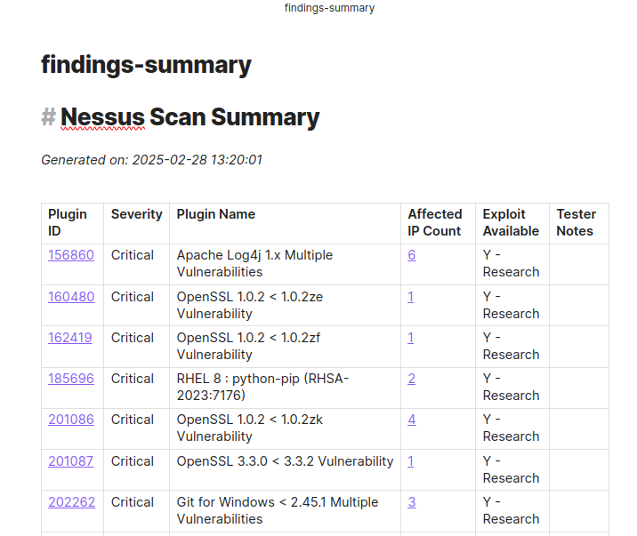
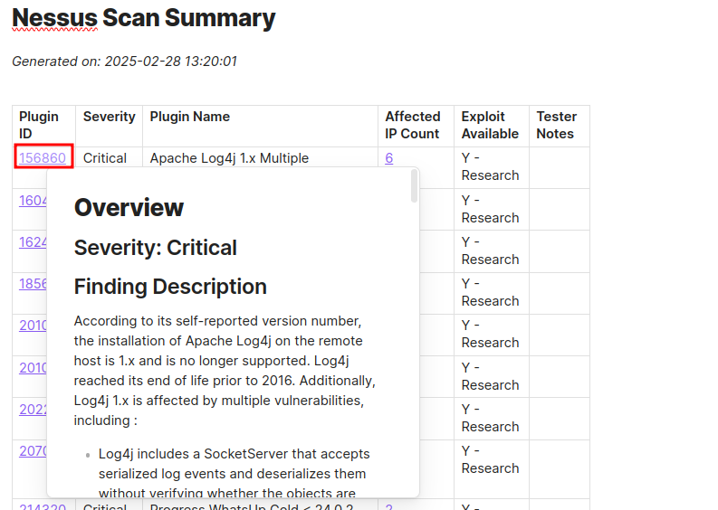
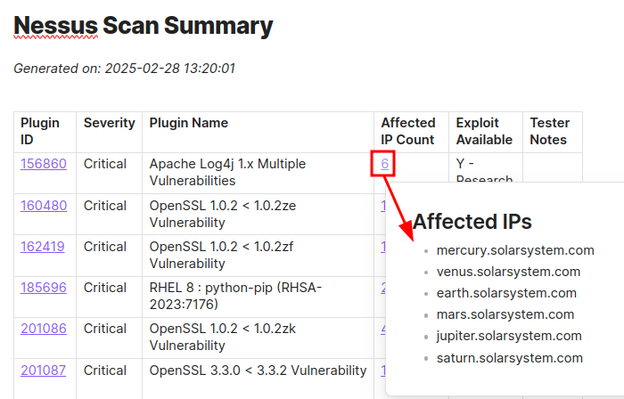
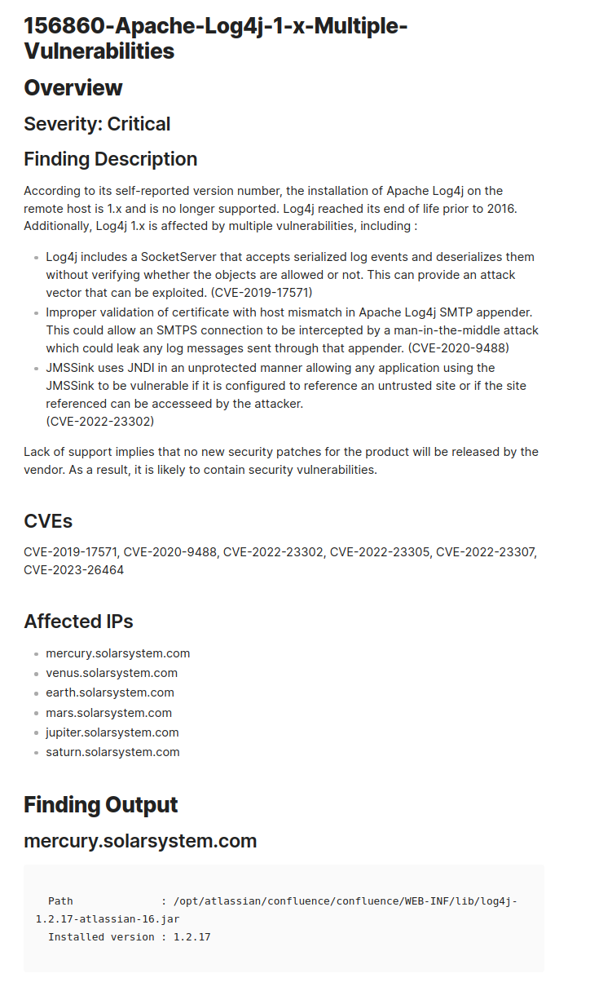
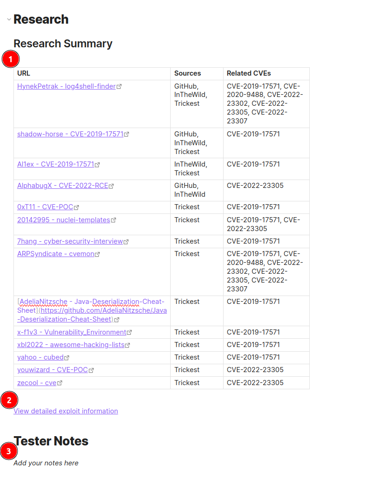

# CVEasy

A comprehensive tool for parsing and analyzing Nessus vulnerability scan files.

## Features

- Parse one or more Nessus (.nessus) XML files or directories containing .nessus files
- Generate summary reports in Markdown or CSV format
- Create detailed finding files with descriptions, affected IPs, and outputs
- Research CVEs using multiple sources. **HUGE** shoutout to these tools/repos, which make this tool much more streamlined:
  - [go-exploitdb](https://github.com/vulsio/go-exploitdb)
  - [trickest/cve](https://github.com/trickest/cve) repository
- Generate Research Summary tables with deduplicated exploit links
- Create detailed exploit information files
- Obsidian-compatible links for easy navigation between summary and findings

## Known Constriants
- [Certain configurations of Tenable.sc](https://community.tenable.com/s/question/0D53a00006XvNwBCAV/tenablesc-nessus-file-exports-missing-critical-plugin-data?language=en_US) are known to exclude the necessary information used in `CVEasy.py` to populate the findings.  If the information is missing from the `.nessus` file, the findings files will likely be bare, and it is unlikely that research capabilities are possible. The tool was successfully tested using `.nessus` files exported from Tenable Professional.

## Installation

### Prerequisites

1. Python 3.8 or higher (tested on 3.10.12)
2. Required Python packages:
	- `requests` - necessary for collecting Github star count data for POC lookups (tested on version 2.32.3). 

### Setup for go-exploitdb (optional)

1. Install go-exploitdb following instructions at https://github.com/vulsio/go-exploitdb
2. Update the database:
   ```
   go-exploitdb fetch exploitdb
   go-exploitdb fetch awesomepoc
   go-exploitdb fetch githubrepos
   go-exploitdb fetch inthewild
   ```

### Setup for trickest/cve (optional)

Clone the repository to your local system:
```
git clone https://github.com/trickest/cve.git /path/to/trickest-cve
```

## Usage

Basic usage:
```
python CVEasy.py /path/to/files/*.nessus
```

Generate summary and finding files with research:
```
python CVEasy.py -o ./client-report -p client-name -f -r --exploitdb-path /opt/go-exploitdb/go-exploitdb.sqlite3 --trickest-path /path/to/trickest-cve /path/to/files/*.nessus
```

Generate CSV output:
```
python CVEasy.py --csv -o ./client-report -p client-name /path/to/files/*.nessus
```

Generate CSV output with research data:
```
python CVEasy.py --csv -r -o ./client-report -p client-name /path/to/files/*.nessus
```

Scan a directory for .nessus files:
```
python CVEasy.py -f -r /path/to/nessus/directory/
```

## Command Line Options

```
usage: CVEasy.py [-h] [-o OUTPUT_DIR] [-p PREFIX] [-f] [--findings-subdir FINDINGS_SUBDIR]
                      [--no-exploit-details] [--csv] [-r]
                      [--research-sources RESEARCH_SOURCES] [--exploitdb-path EXPLOITDB_PATH]
                      [--trickest-path TRICKEST_PATH] [-v]
                      input_files [input_files ...]

Parse Nessus files and generate reports

positional arguments:
  input_files            Path(s) to Nessus files. Can use wildcards (e.g., *.nessus) or directories

optional arguments:
  -h, --help            show this help message and exit
  -o OUTPUT_DIR, --output-dir OUTPUT_DIR
                        Output directory for reports (default: current directory)
  -p PREFIX, --prefix PREFIX
                        Prefix for output files (e.g., client-name)
  -f, --create-findings
                        Create individual finding files
  --findings-subdir FINDINGS_SUBDIR
                        Subdirectory for finding files (default: findings)
  --no-exploit-details   Disable generation of exploit details files
  --csv                 Generate CSV output instead of markdown
  -r, --research        Research CVEs using available sources
  --research-sources RESEARCH_SOURCES
                        Comma-separated list of research sources (default: exploitdb,trickest)
  --exploitdb-path EXPLOITDB_PATH
                        Path to go-exploitdb database
  --trickest-path TRICKEST_PATH
                        Path to trickest/cve repository clone
  -v, --verbose         Enable verbose output
```

## Output

### Summary File

The summary file (`[prefix]-nessus-summary.md`) contains:
- A table with all findings sorted by exploit availability and severity
  - Exploit availability is broken down into 3 categories:
    - `Y - Research` - when the `-r`/`--research` flag is used, if one of the CVE repositorites identifies a PoC
    - `Y - Nessus` - when the Nessus plugin data specifies a vulnerability exists.  If `-r`/`--research` flag is used, but a finding has this designation, it means the research efforts did not return any PoCs.
    - 'N' - No exploits available :( - but that doesn't mean the finding isn't worth looking at!
- Links to individual finding files (when using the `-f` option)
- An additional column for Tester Notes
- Summary statistics including:
  - Total unique targets (split into IPs and hostnames)
  - Total unique findings
  - Findings by severity
  - Findings with exploits

### Finding Files

Each finding file (`findings/[PluginID]-[Plugin Name].md`) contains:
- Severity level
- Description
- Associated CVEs as a comma-separated list
- List of affected IP addresses
- Plugin output for each affected IP (if available)
- Research Summary table with links organized by source
- Link to detailed exploit information (if available)
- A section for tester notes

### Exploit Details Files

Each exploit details file (`findings/exploit-details/[PluginID]-[Plugin Name]-exploit-details.md`) contains:
- Go-ExploitDB information including:
  - URLs
  - Descriptions
  - Sources
  - Related CVEs
- Trickest information including:
  - Descriptions
  - References
  - Proof of concept details
  - MITRE CVE links

### CSV Output

When using the `--csv` option, two CSV files are created:

1. `[prefix]-nessus-summary.csv` with columns for:
   - Plugin ID
   - Severity
   - Plugin Name
   - Affected IPs
   - CVEs
   - Exploit Availability

2. When using both `--csv` and `-r`/`--research`, an additional `[prefix]-nessus-findings.csv` is created with columns for:
   - Plugin ID
   - Finding Name
   - Finding Description
   - CVEs (comma-separated list)
   - Affected IPs (comma-separated list)
   - Research (each URL with its sources on a separate line)

## Examples

### Processing Multiple Files and Directories

```bash
# Process all .nessus files in multiple directories
python CVEasy.py -f -r /path/to/dir1/ /path/to/dir2/ /specific/file.nessus
```

### Generating Comprehensive Reports

```bash
# Generate complete reports with all research sources
python CVEasy.py -o ./reports -p client-2025 -f -r \
  --exploitdb-path /opt/go-exploitdb/go-exploitdb.sqlite3 \
  --trickest-path /opt/trickest-cve \
  /path/to/scan/data/
```

### CSV-Only Output

```bash
# Generate only CSV files (no markdown)
python CVEasy.py --csv -r -o ./csv-reports -p client-2025 /path/to/scan/data/
```

### Disabling Exploit Details Files

```bash
# Generate findings but no exploit details files
python CVEasy.py -f -r --no-exploit-details /path/to/scan/data/
```

# Example Screenshots
Since pictures "say a thousand words" - some example views in Obsidian after running a findings and research analysis:
```bash
python CVEasy.py -f -r --exploitdb-path /opt/go-exploitdb/go-exploitdb.sqlite3 --trickest-path /path/to/trickest-cve /path/to/files/*.nessus
```
## Findings Summary
Example of a Findings Summary table, assuming "research" has been done.


### Findings Summary Obsidian Links
#### Plugin ID Links to Finding `.md` File
Hovering over a Plugin ID for a finding displays the contents of the finding/plugin file.


#### Affected IP Links to Section in Finding `.md` File
For a quick reference of the affected systems, hover over the "Affected IP" count in Obsidian.


## Finding Details
### Nessus Data
Displays information about the plugin, including the severity, description, applicable CVEs, and the affected systems.  If the plugin collected output, it's provided for each host within the finding file.

### Research
Further down within the same file:
1. a concise list of Github repositories, which are collected from go-exploitdb/trickest.
2. A link to the plugin's `-exploit-details.md` file which has more granular information if preferred
3. Tester's Notes section - to easily delineate end of the report, but allow for tester to use for documenting further testing efforts.


# Future Enhancements
- Adding additional datasets/repositories for CVE lookup.
- Improved ordering of finding information in summary tab.
- Parsing/ranking of github links within the CVE information (perhaps based on the number of github stars?)
- Tagging/Flagging of certain useful plugins (i.e. useful data in plugin output, or plugin warrants further enumeration of service/system).
- Cleanup of nessus data prior to writing to file to eliminate unnecessary whitespace.
- Open to suggestions!
